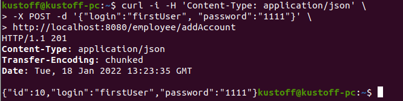

# Приложение Auth

## О проекте
#### Описание
Учебный проект. Знакомство с механизмом интеграции Rest-сервисов в приложениях. 
Работа с RestTemplate в SpringBoot-приложениях. Взаимодействие с приложением осуществляется через утилиту *cURL*

#### Технологии
>JDK14, Maven, PostgreSQL, Spring Boot (Web, Data), Junit

## Сборка
0. Загружаем исходники проекта

1. Создаем базу данных и таблицы по файлу конфигурации: *auth/src/main/resources/application.properties*

2. Собираем приложение: `cd auth`, `mvn install`

3. Запускаем приложение: `java -jar target/auth-3.0.jar`

## Как пользоваться
В приложении есть две модели данных: Person - аккаунт и Employee - сотрудник компании.
Employee содержит обязательно данные: имя и фамилия, ИНН, дата найма, а также ссылку на список его аккаунтов,
которыми сотрудник пользуется для доступа к ресурсам корпоративной площадки.
Имеются два контроллера, для работы с моделями: PersonController, EmployeeController.
Цель: 
*реализовать работу по созданию аккаунтов (Person) через контроллер для работы с сотрудниками (EmployeeController)*
Проверяем работу контроллеров, выполнив команду в терминале:

`curl -i -H 'Content-Type: application/json' -X POST -d '{"login":"firstUser", "password":"1111"}' http://localhost:8080/employee/addAccount`

## Контакты
Кутявин Владимир Анатольевич

skype: tribuna87

email: tribuna87@mail.ru

telegram: @kutiavinvladimir